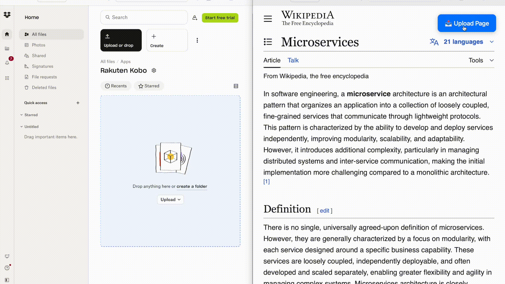

# Kobox

With Firefox deprecating Pocket and the profusion of ads making it painful to read in the browser, a new solution was needed to enable seamless read-later functionality for Kobo eReaders. Leveraging Kobo's native Dropbox integration, __Kobox__ is a comprehensive solution for seamlessly transforming any webpage into an ad-free, highly readable EPUB with automatic syncing onto device.

## Overview

Kobox provides a streamlined workflow for digital reading enthusiasts who want to save web content for offline reading on their Kobo eReader. The solution includes:

1. **Server Application**: A backend service that processes URLs and HTML content, converts them to EPUB format, and automatically uploads them to your Dropbox account for synchronization with your eReader
2. **Browser Extension**: A lightweight client-side tool that enables one-click content sending directly from your web browser



## Features

- **One-Click Content Transfer**: Send web pages to your eReader with a single click
- **Automatic Format Conversion**: Converts web content to EPUB format optimized for eReaders
- **Dropbox Integration**: Seamless synchronization through Dropbox's cloud storage
- **Flexible Input Methods**: Supports both URL-based and direct HTML content processing
- **RESTful API**: Programmatic access for advanced users and integrations

## Getting Started

### Prerequisites

- Kobo eReader with Dropbox integration configured
- User script manager extension (Tampermonkey, Violentmonkey, or similar)
- Docker (for containerized deployment) or local development environment with Pandoc

### Installation

#### Option 1: Docker Deployment (Recommended)

```bash
docker run -p 12332:12332 -v ./certs:/app/certs danielwolber-wood/kobox-mono
```

#### Option 2: Local Installation

1. Clone the repository and install dependencies
2. Ensure Pandoc is installed on your system
3. Run the server application

### Configuration

1. **Configure Dropbox on your eReader**: Ensure your Kobo device is connected to your Dropbox account
2. **Install the browser extension**: Add the user script (`script.js`) to your user script manager
3. **Start the server**: Launch the Kobox server application
4. **Authorize Dropbox access**: Navigate to `https://localhost:12332/config` and complete the Dropbox authorization process
5. **Begin using**: Use either the browser extension button or direct API calls to send content to your eReader

## API Reference

### URL Upload

Convert and upload web pages by URL:

```bash
curl -X POST http://localhost:12332/v2/api/upload/url \
  -H "Content-Type: application/json" \
  -d '{
    "url": "https://example.com",
    "title": "Example Website"
  }'
```

### HTML Upload

Convert and upload raw HTML content:

```bash
curl -X POST http://localhost:12332/v2/api/upload/html \
  -H "Content-Type: application/json" \
  -d '{
    "html": "<html><head><title>Test Page</title></head><body><h1>Hello World</h1><p>This is a test page.</p></body></html>",
    "title": "Test HTML Page"
  }'
```

## Deployment Options

### Quick Start with Docker Compose

For simplified deployment, a Docker Compose configuration is available for easy distribution and setup.

### Production Deployment

The project supports deployment to cloud platforms with the following considerations:
- HTTPS configuration for secure communication
- Multi-user authentication and authorization
- Scalable infrastructure for concurrent users

## Development Roadmap

### Infrastructure & Deployment
- Enhanced Docker Compose configuration for end-user distribution
- Comprehensive CI/CD pipeline implementation
- Automated testing suite development

### Cloud Platform Integration
- Production-ready deployment on Google Cloud Platform
- SSL certificate management and HTTPS enforcement
- OAuth 2.0 integration with Google Sign-In
- Multi-tenant architecture support

### Application Enhancements
- Advanced configuration management system
- Robust error handling and task retry mechanisms
- Enhanced logging and monitoring capabilities

## Contributing

We welcome contributions to improve Kobox. Please feel free to submit issues, feature requests, or pull requests to help make web-to-eReader content transfer even better.

## License

MIT

## Support

For questions, issues, or feature requests, please refer to the project's issue tracker or documentation.
